# Entity Relationship Diagram (ERD) - NominaApp

## Esquema de Base de Datos Supabase

Diagrama ER en formato Mermaid con las 45 tablas y sus relaciones principales (cardinalidad y Foreign Keys).

```mermaid
erDiagram
    %% TABLAS BASE
    companies ||--o{ projects : has
    companies ||--o{ bank_accounts : owns

    %% PROYECTOS Y MIEMBROS
    projects ||--o{ project_members : "has members"
    user_profiles ||--o{ project_members : "is member"
    projects ||--o{ budget_categories : "has categories"
    projects ||--o{ price_list_items : "has prices"
    projects ||--o{ contractors : "employs"
    projects ||--o{ suppliers : "buys from"
    projects ||--o{ bank_accounts : "uses accounts"

    %% PRESUPUESTO
    budget_categories ||--o{ budget_items : "contains items"
    budget_categories ||--o{ transactions : "refs category"
    budget_categories ||--o{ material_invoices : "refs category"

    %% NÓMINAS Y CONTROL FINANCIERO
    projects ||--o{ payroll_periods : "has periods"
    payroll_periods ||--o{ labor_line_items : "has labor"
    payroll_periods ||--o{ material_invoices : "has materials"
    payroll_periods ||--o{ indirect_costs : "has indirects"
    payroll_periods ||--o{ payment_distributions : "distributes"
    payroll_periods ||--o{ transactions : "generates"

    contractors ||--o{ labor_line_items : "performs work"
    suppliers ||--o{ material_invoices : "invoiced by"
    suppliers ||--o{ transactions : "supplies"

    %% PAGOS Y DISTRIBUCIONES
    bank_accounts ||--o{ payment_distributions : "receives"

    %% CALIDAD Y CUBICACIONES
    projects ||--o{ quality_control : "has QC"
    projects ||--o{ contract_cubications : "cubications"
    contractors ||--o{ contract_cubications : "work cubications"

    %% ÓRDENES DE COMPRA
    projects ||--o{ purchase_requisitions : "has requisitions"
    purchase_requisitions ||--o{ purchase_quotes : "gets quotes"
    suppliers ||--o{ purchase_quotes : "quotes"
    purchase_quotes ||--o{ purchase_quote_items : "contains items"

    %% MÓDULO CUBICACIÓN v2
    projects ||--o{ adjustment_contracts : "has contracts"
    contractors ||--o{ adjustment_contracts : "signs contracts"
    adjustment_contracts ||--o{ contract_partidas : "has partidas"
    adjustment_contracts ||--o{ contract_cortes : "has cortes"
    adjustment_contracts ||--o{ contract_adelantos : "advances"
    contract_partidas ||--o{ contract_cortes : "measured in"
    contract_cortes ||--o{ payroll_periods : "linked to"

    %% PRÉSTAMOS
    contractors ||--o{ contractor_loans : "receives loans"
    contractor_loans ||--o{ loan_deductions : "deductions"
    payroll_periods ||--o{ loan_deductions : "deducts from"

    %% OBRA Y DOCUMENTOS
    projects ||--o{ bitacora_entries : "has logs"
    projects ||--o{ attendance_records : "tracks attendance"
    contractors ||--o{ attendance_records : "attends"
    projects ||--o{ inventory_items : "inventory"
    inventory_items ||--o{ inventory_movements : "movements"
    suppliers ||--o{ inventory_movements : "supplies inventory"
    projects ||--o{ schedule_tasks : "has tasks"
    contractors ||--o{ contractor_documents : "has documents"

    %% PRESUPUESTOS IMPORTADOS (MERCADO)
    projects ||--o{ mercado_budgets : "imports budgets"
    mercado_budgets ||--o{ mercado_budget_lines : "budget lines"
    adjustment_contracts ||--o{ mercado_budget_lines : "linked contract"
```

## Resumen de Tablas (45 total)

### Gestión Básica (4)

- `companies` - Empresas
- `projects` - Proyectos
- `contractors` - Contratistas
- `suppliers` - Proveedores

### Gestión de Usuarios (2)

- `user_profiles` - Perfiles de usuarios
- `project_members` - Miembros del proyecto

### Cuentas Bancarias (1)

- `bank_accounts` - Cuentas bancarias

### Presupuesto (3)

- `budget_categories` - Categorías presupuestarias
- `budget_items` - Items presupuestarios
- `price_list_items` - Lista de precios

### Nóminas y Pagos (7)

- `payroll_periods` - Períodos de nómina
- `labor_line_items` - Líneas de trabajo
- `material_invoices` - Facturas de materiales
- `indirect_costs` - Costos indirectos
- `payment_distributions` - Distribuciones de pago
- `transactions` - Transacciones financieras
- `contractor_loans` - Préstamos a contratistas

### Deducción de Préstamos (1)

- `loan_deductions` - Deducciones de préstamos

### Calidad y Cubicaciones v1 (2)

- `quality_control` - Control de calidad
- `contract_cubications` - Cubicaciones de contratos

### Órdenes de Compra (3)

- `purchase_requisitions` - Requisiciones de compra
- `purchase_quotes` - Cotizaciones de proveedores
- `purchase_quote_items` - Items de cotización

### Cubicaciones v2 (4)

- `adjustment_contracts` - Contratos ajustados
- `contract_partidas` - Partidas de contrato
- `contract_cortes` - Cortes de medición
- `contract_adelantos` - Anticipos de contrato

### Obra y Documentación (6)

- `bitacora_entries` - Bitácora de obra
- `attendance_records` - Registros de asistencia
- `inventory_items` - Items de inventario
- `inventory_movements` - Movimientos de inventario
- `schedule_tasks` - Tareas del cronograma
- `contractor_documents` - Documentos de contratistas

### Presupuestos Importados (2)

- `mercado_budgets` - Presupuestos importados (Mercado)
- `mercado_budget_lines` - Líneas de presupuesto importado

## Relaciones Principales

### Cardinalidad

- **1:N** - Una empresa tiene múltiples proyectos, un proyecto tiene múltiples períodos, etc.
- **M:N** - Usuarios a proyectos (vía `project_members`)

### Cascadas

- `ON DELETE CASCADE` en casi todas las FKs a `projects`
- Garantiza integridad referencial y limpieza automática

### FK Opcionales

- Algunas FKs son `nullable` (ej: `contract_cortes.linked_payroll_id`)
- Permite flexibilidad en asociaciones parciales
